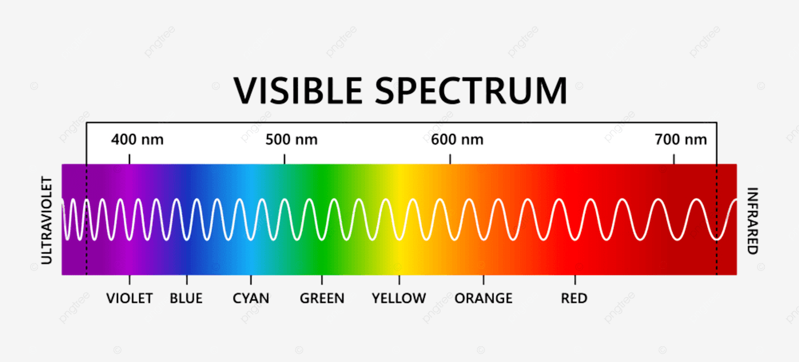
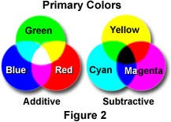
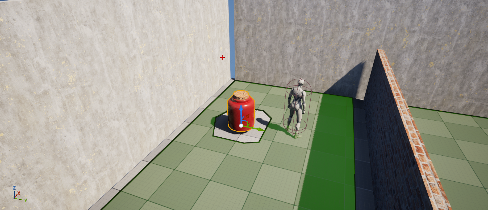
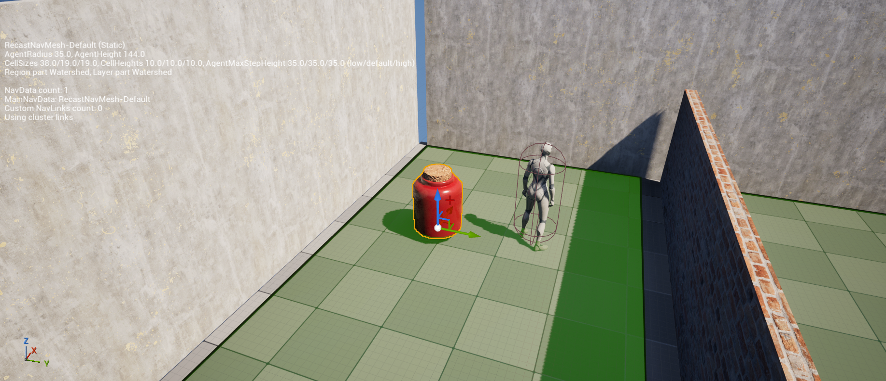
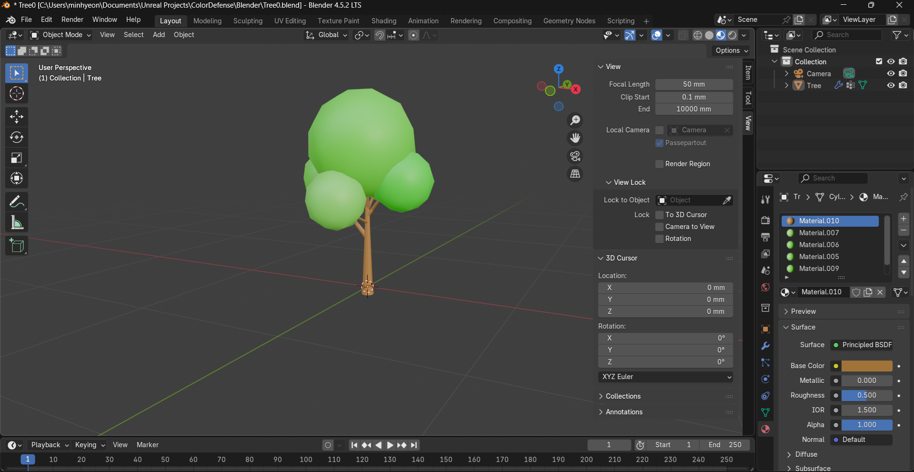
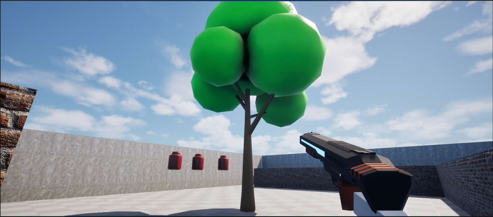

# [ Color Defense ]

  
아이디어 & 컨셉

  <ul>
    <li>

      
색의 혼합 & 흡수

        

          
          
        

      <ul>
        <li>태양같은 백광색은 모든 파장의 빛이 혼합된 것 (additive mixing) </li>
        <li>노랑색으로 보이는 방법 = 빨간 파장 + 초록 파장 or 단일 파장 570~590 nm</li>
        <li>ColorGun이 특정 파장의 빛을 흡수하는 컨셉</li>
        <li>additive mixing 개념을 주로 사용할 예정</li>
      </ul>
    
</li>
    <li>

      
Color Gun

      <ul>
        <li>R, G, B 세 종류</li>
        <li>각각 해당 색깔에 맞는 파장만 흡수</li>
        <li>ex) Yellow Creep을 흡수하려면 R, G Color Gun을 사용해야 함</li>
        <li>EyeDropper Gun : 주변 사물 색깔을 복사, 발사 횟수 제한 
        <li>+) 건설, ...</li>
      </ul>
    
</li>
    <li>

      
Color Creep

      <ul>
        <li>특정 빛의 파장을 내뿜는 Creep</li>
        <li>Red Creep => Red Color Gun으로 흡수</li>
      </ul>
    
</li>
    <li>

      
기타

      <ul>
        <li>시작 메뉴판 : 설정을 다 지워야 시작 / 게임 컨셉 자연스럽게 학습</li>
        <li>대쉬, 점프</li>
      </ul>
    
</li>
  </ul>

## 크립 이동

NavMesh 정리

<ul>
  <li>navigation mesh</li>
  <li>삼각형은 유일한 평면을 결정하기 때문에 NavMesh에서 폴리곤으로 삼각형 사용</li>
  <li>PlaceActors / NavMeshBoundsVolume 으로 NavMesh 자동 생성</li>
  <li>P로 자동생성된 NavMesh를 볼 수 있음</li>
  <li>NavMeshBoundsVolume 설치 시 RecastNavMesh-Default actor 자동 생성</li>
  <li>RecastNavMesh-Default / Details / Display / Draw Offset 으로 경사면에서의 NavMesh 생성 조절</li>
</ul>

  
 Ai Move To 노드에 Pawn을 연결하니 움직이지 않는 문제 

  

    
    
  

  <ul>
    <b>[ 문제 상황 ]</b>
    <li>BP_APawnCreep이 AI Move To 노드로 움직여지지 않음</li>
     
    <b>[ 해결 방법 ]</b>
    <li>SM_Jar_01 / Details / Navigation / Advanced / Can Ever Affect Navigation 비활성화</li>
    <li>floating Movement Component 추가</li>
    <li>보통 SM 들은 저 옵션이 활성화 되어 있어서 NavMesh가 생성될 때 경로에서 제외되어 폰이 갇힌 상태가 되므로 움직일 수 없음</li>
  </ul>

  
 스폰된 BP_Creep이 움직이지 않는 문제 

  

    
    
  

  <ul>
    <b>[문제 상황]</b>
    <li>CreepGenerator에서 Creep이 스폰되도록 구현</li>
    <li>스폰은 되지만 waypoint를 따라 움직이질 않음</li>
     
    <b>[문제 원인]</b>
    <li>BP_Creep이 스폰되면 여러 과정을 거쳐야 함</li>
    <li>그 중 NavMesh가 BP_Creep의 경로를 계산하는 과정과 BP_Creep에 AIController가 빙의되는 과정이 포함되어있음</li>
    <li>현재 NavMesh가 계산한 경로로 움직이는 코드가 BP_Creep에 AIController가 빙의되는 순간 작동하도록 구현되어있음</li>
    <li>그런데 NavMesh가 경로를 계산하는 것 보다 빙의되는 게 더 빠름</li>
    <li>그래서 경로가 아직 계산되지 않았는데 그 경로로 움직이는 코드가 작동됨</li>
    <li>이때 NavMesh는 비정상적인 도착 결과를 그냥 반환해버림</li>
    <li>결과적으로 BP_Creep은 비정상적인 도착 결과를 가짐과 동시에 움직이지 않게 됨</li>
     
    <b>[해결 방법]</b>
    <li>빙의되면 NavMesh가 경로를 계산할 수 있도록 딜레이 코드 작성</li>
    <li>PossessedBy 함수에 WorldTimeManager로 SetTimer 함수 작성</li>
  </ul>

  
reference

  <ul>
    <li>https://dev.epicgames.com/documentation/en-us/unreal-engine/basic-navigation-in-unreal-engine</li>
    <li>https://dev.epicgames.com/documentation/en-us/unreal-engine/unreal-engine-actor-lifecycle</li>

## 1인칭

  
Creep 클릭 시 삭제

  

     
    
  

## 에셋 제작

  
나의 첫 나무

  

     
    
    
    <ul>
      <li>Ref : https://www.youtube.com/watch?v=W337AL7n3dc</li>
  

