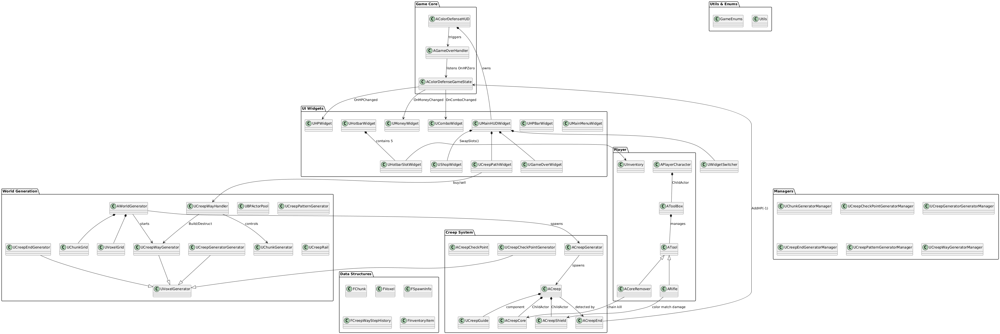

# [ Class Diagram ]

  
 Class Diagram Image 

  

# [ Devlog gifs ]

  
 Shoot Creeps 

  

  
 Generate CreepPath 

  

  
 Creeps following the path 

  

  
 Chain Kill 

  

  
 Place the Playerblock 

  

  
 Turret 

  

  
 Dynamic CreepWay spawning and deletion 

  

  
 Creep Shield 

  

  
 HP Bar 

  

  
 Gun Recoil 

  

  
 Flying 

  

  
 World Overview 

  

